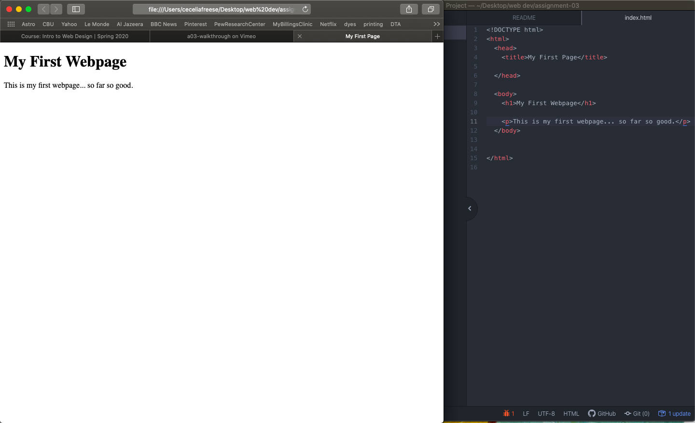

# Assignment 3
## Cecelia Freese

How do browsers function? List browsers you use.

  Through your web browser, a request for information is sent to a server
  which sends back a series of files used to construct a webpage.

  Most of my browsing is done through Safari, Chrome and occasionally
  Firefox.

What is a markup language? Describe one commonly used in development.

  A markup language is a language used for the text content of a webpage.

  One commonly used in web development is XML. It is used with HTML and
  is written in plain text, making data transferring easier.

