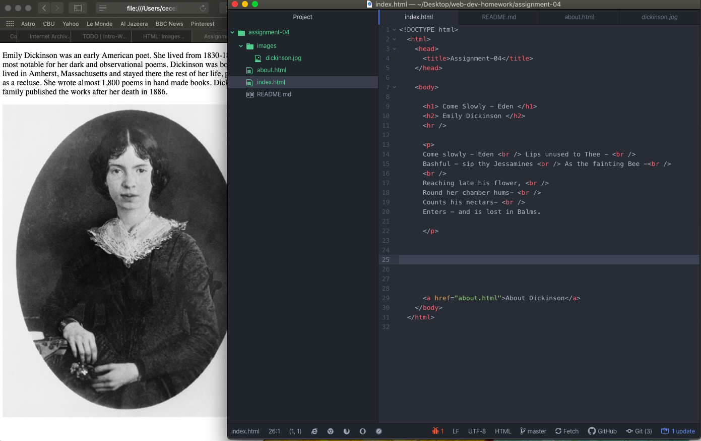

# Assignment 4
##Cecelia Freese

Using The Wayback Machine, I visited Amazon.com from February 4, 2005. The general layout of the site is the same, but the colors and fonts are different. Modern Amazon is image heavy, whereas 2005 Amazon's homepage is mostly hyperlink text.

This is not my first time using GitHub Desktop. But, in the two years since I've used it, a lot of the information got lost. Its was nice to have a quick refresher. Getting back into pushing items from my computer to the web is nice for workflow, and less confusing. I was also able to get rid of a duplicate file from last week.

